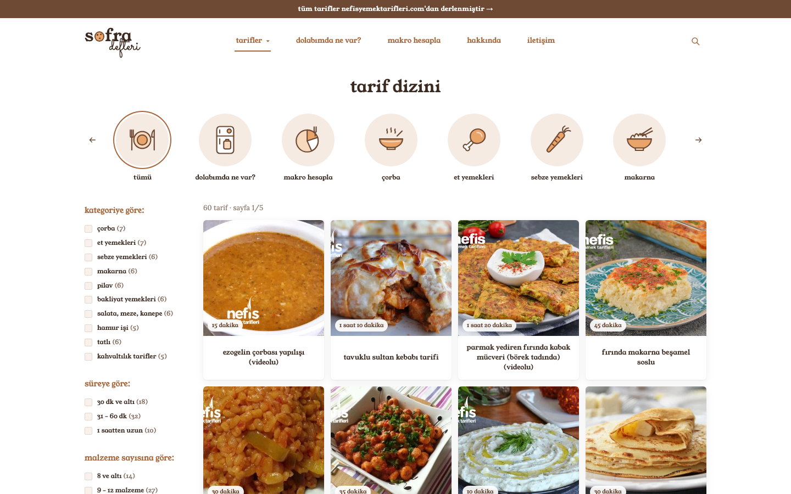

<h1 align="center">sofra defteri</h1>

<p align="center"><strong>Tarifini bul. Dolabına bak. Makronu hesapla.</strong></p>

<p align="center">
  <a href="https://www.python.org"></a>
  <a href="https://www.crummy.com/software/BeautifulSoup/"></a>
  <a href="https://requests.readthedocs.io"></a>
  <a href="https://lxml.de"></a>
  <a href="https://developer.mozilla.org/docs/Web/HTML"></a>
  <a href="https://developer.mozilla.org/docs/Web/CSS"></a>
  <a href="https://developer.mozilla.org/docs/Web/JavaScript"></a>
  <a href="https://vercel.com"></a>
</p>

Türk mutfağından seçilmiş tarifleri tek sayfada toplayan bir tarif dizini. Tarifler Python ile
nefisyemektarifleri.com'dan kazınır, tek bir `recipes.json` dosyasına yazılır ve arayüz
yalnızca bu dosyayı okuyarak çalışır. Veritabanı, sunucu ya da API yoktur.

> **Not:** Bu proje **Nesne Tabanlı Programlama** dersi için yapılmıştır.
> Herhangi bir kâr amacı gütmemektedir.

**Canlı site:** https://sofradefteri.vercel.app



## Özellikler

- **Tarif dizini:** kategori daireleri, kategori, süre, malzeme sayısı ve kişi sayısına göre filtre,
  ad ya da malzemeye göre arama, sayfalama
- **Tarif detayı:** malzeme listesi (işaretlenebilir), porsiyon, süre, tahmini besin değerleri,
  orijinal tarife bağlantı ve benzer tarifler
- **Dolabımda ne var?:** evdeki malzemeleri seç, hemen yapabileceğin tarifleri ve 1-2 malzemesi
  eksik olanları gör
- **Makro hesapla:** cinsiyet, aktivite, hedef, yaş, boy ve kiloya göre günlük kalori ve
  protein / karbonhidrat / yağ ihtiyacı; öğün hedefine uyan tarifler ve önerilen porsiyon
- Paylaşılabilir sonuç bağlantısı ve başka sitelere gömülebilir hesaplama aracı (`iframe`)
- Masaüstü ve mobil uyumlu, derleme adımı gerektirmeyen statik arayüz

## Teknoloji yığını

| Parça | Seçim |
| --- | --- |
| Veri toplama | Python 3.10+, `requests`, `beautifulsoup4`, `lxml` |
| Veri formatı | Tek dosya: `recipes.json` (UTF-8), ayrıca `recipes.csv` |
| Arayüz | Düz HTML, CSS ve JavaScript (çatı yok, derleme yok) |
| Yazı tipleri | Young Serif, Lora, Sacramento (Google Fonts) |
| İkonlar | Elle çizilmiş satır içi SVG |
| Yayın | Vercel (statik site) |

Python tarafında standart kütüphane dışındaki bağımlılıklar yalnızca `requests`, `beautifulsoup4`
ve `lxml`'dir.

## Nesne yönelimli yapı

Dersin ana konusu olan sınıflar `backend` klasöründedir. Her sınıfın tek bir görevi vardır.

| Sınıf | Dosya | Görevi |
| --- | --- | --- |
| `Recipe` | `models/recipe.py` | Tek bir tarif. Veriyi tutar, temizler ve kendini sözlüğe çevirir. |
| `RecipeCollection` | `models/recipe.py` | Tarifleri `{"recipe1": Recipe, "recipe2": Recipe, ...}` biçiminde tutar, tekrarı engeller, JSON ve CSV yazar. |
| `RecipeScraper` | `services/scraper.py` | Siteye gider, sayfaları indirir, her tarif için bir `Recipe` üretir ve hepsini bir `RecipeCollection` içinde döndürür. |

Kullanılan kavramlar: kurucu metot, `__str__` / `__repr__` / `__len__` / `__iter__` /
`__getitem__` gibi sihirli metotlar, `@classmethod` fabrika metotları (`from_soup`,
`from_jsonld`, `from_dict`), `@property`, `@staticmethod`, kapsülleme ve kompozisyon.

`recipe1`, `recipe2` gibi adlar döngüde dinamik değişken üretmek yerine sözlük anahtarı
olarak tutulur. Dinamik değişken (`globals()`) IDE tarafından görülmez, hata ayıklamayı
zorlaştırır ve isim çakışmalarına açıktır.

## Nasıl çalışır

1. **Kazıma:** `RecipeScraper` kategori sayfalarını gezer (`/page/N/`), tarif linklerini toplar
   ve kategoriler arasında sırayla ilerler. İstekler arasında 1,5 sn bekler, hata olursa 3 kez
   artan beklemeyle tekrar dener, robots.txt kurallarına uyar.
2. **Okuma:** Önce sayfadaki schema.org JSON-LD verisi aranır, yoksa HTML'den `config.py`
   içindeki seçicilerle okunur. Sitenin yapısı değişirse yalnızca bu dosya güncellenir.
3. **Zenginleştirme:** Her malzeme satırından sade malzeme adı çıkarılır
   ("1 su bardağı kırmızı mercimek" → `mercimek`) ve miktarlardan porsiyon başına
   **tahmini** kalori ve makro hesaplanır.
4. **Çıktı:** `RecipeCollection` her şeyi `recipes.json` ve `recipes.csv` dosyalarına yazar.
5. **Arayüz:** Tarayıcı `recipes.json`'u okur. Filtreleme, eşleştirme ve makro hesabı
   tamamen tarayıcıda yapılır.

Makro hesabı Mifflin-St Jeor formülüne dayanır. Kaynak site besin değeri vermediği için
tarif değerleri malzeme listesinden tahmin edilir ve ±%20-30 sapabilir. Araç tıbbi tavsiye değildir.

## Yerel geliştirme

```bash
python3 -m venv .venv
source .venv/bin/activate
pip install -r requirements.txt

# Tarifleri kazı (varsayılan: 4 kategoriden 15 tarif)
cd backend
python main.py
python main.py --category hepsi --limit 60     # tüm kategorilerden 60 tarif
python main.py --retag                         # siteye gitmeden etiket ve besin değerlerini yenile

# Siteyi aç
cd ..
python3 -m http.server 8137                    # http://localhost:8137/frontend/
```

Komut seçenekleri: `--limit`, `--category`, `--output`, `--verbose`, `--retag`.

## Vercel'e yayınlama

| Ayar | Değer |
| --- | --- |
| Root Directory | boş (repo kökü) |
| Framework Preset | `Other` |
| Build / Output / Install Command | boş |

- Vercel `requirements.txt` dosyasını görünce projeyi Python sanabilir. Framework Preset
  mutlaka **Other** olmalı, aksi halde derleme "No python entrypoint found" hatası verir.
- Kazıyıcı Vercel'de çalışmaz. Tarifleri güncellemek için `python main.py` yerelde çalıştırılır
  ve yeni `recipes.json` repoya gönderilir. Vercel siteyi kendiliğinden yeniden yayınlar.

## Veri kaynağı ve telif

- Tarif metinleri ve görseller **nefisyemektarifleri.com** ve tarif sahiplerine aittir. Her tarifin
  detay sayfasında orijinal kaynağa bağlantı bulunur.
- Kazıyıcı robots.txt kurallarına uyar ve istekleri yavaşlatır. Site, robots.txt dosyasında
  içeriğinin toplu kullanılmasını istemediğini belirtir. Bu nedenle proje yalnızca eğitim
  amaçlıdır ve ticari olarak kullanılmamalıdır.
- Aşağıdaki MIT lisansı **yalnızca bu projenin kaynak kodunu** kapsar. Kazınan içerik bu
  lisansın kapsamında değildir.

## Proje yapısı

```
index.html                 kök sayfa (frontend/'e yönlendirir, paylaşım etiketleri)
og-image.png               paylaşım önizleme görseli (1200x630)
requirements.txt
LICENSE
backend/
  main.py                  giriş noktası (argparse, özet rapor, örnek kullanım)
  config.py                ayarlar, kategori adresleri, HTML seçicileri
  models/recipe.py         Recipe ve RecipeCollection sınıfları
  services/scraper.py      RecipeScraper sınıfı
  utils/helpers.py         clean_text, slugify, build_image_url
  utils/ingredients.py     malzeme kataloğu ve etiket çıkarma
  utils/nutrition.py       miktar okuma ve tahmini besin değeri
  output/                  recipes.json, recipes.csv, recipes_aciklamali.jsonc
frontend/
  index.html, css/style.css, js/app.js, js/icons.js
docs/
  TEKNIK.md                ayrıntılı teknik belge
  ekran-goruntusu.png
```

Ayrıntılı teknik belge (JSON alanları, seçicilerin nasıl güncelleneceği, hesaplama tabloları):
[docs/TEKNIK.md](docs/TEKNIK.md)

## Lisans

MIT, bkz. [LICENSE](./LICENSE). Çağlar Sapmaz tarafından yapıldı.
